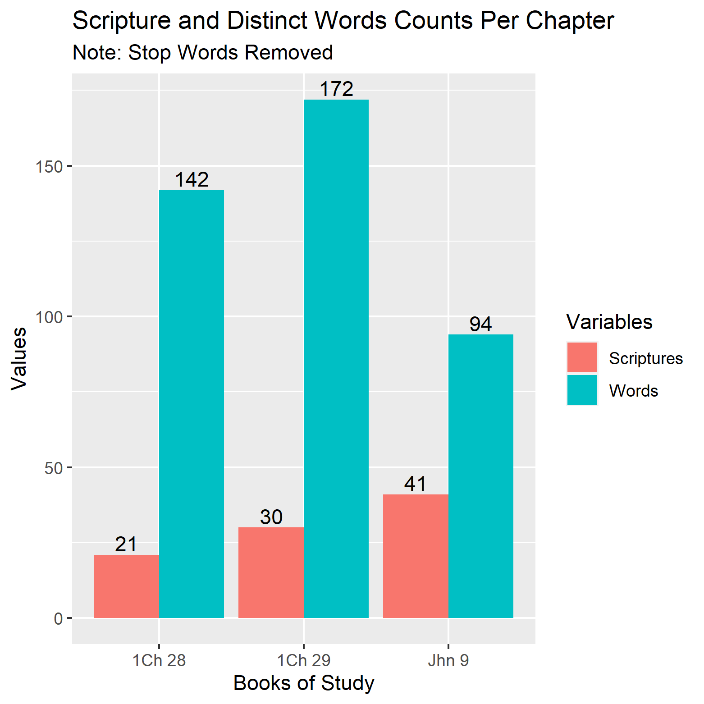
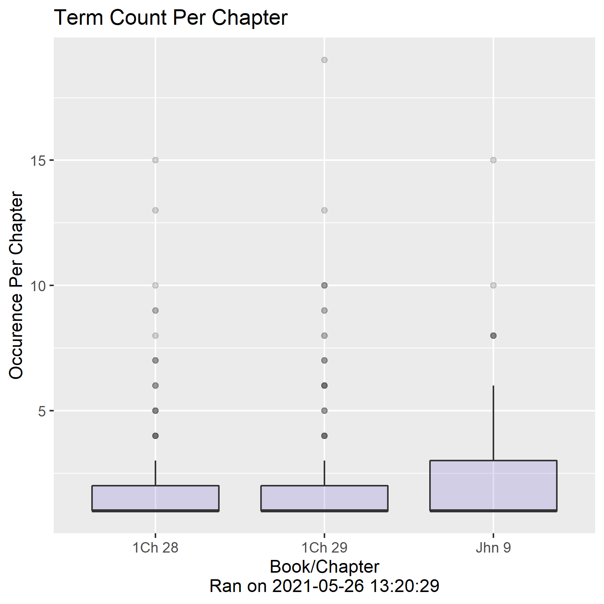
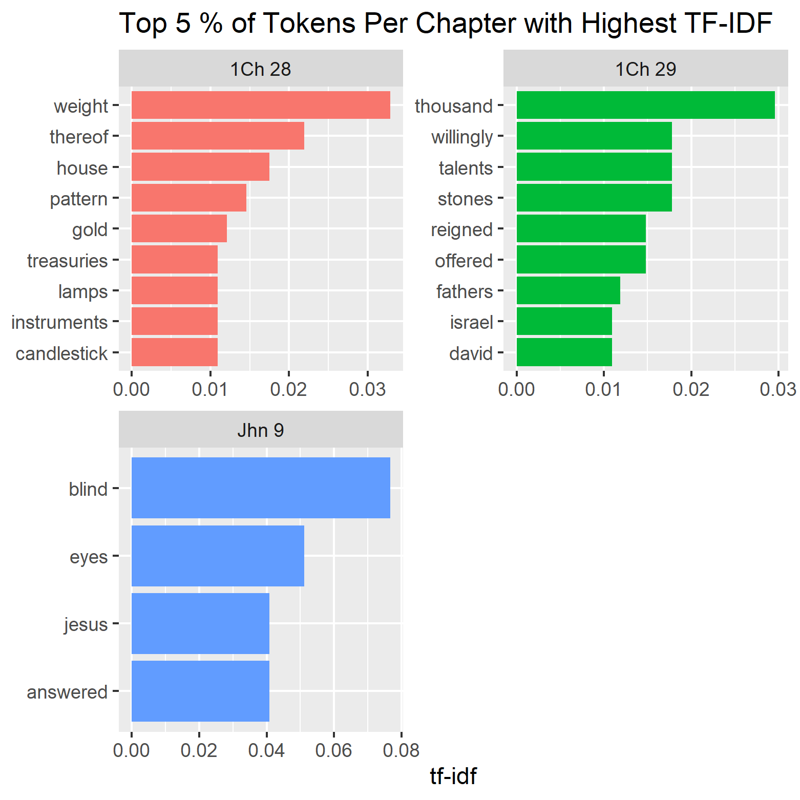
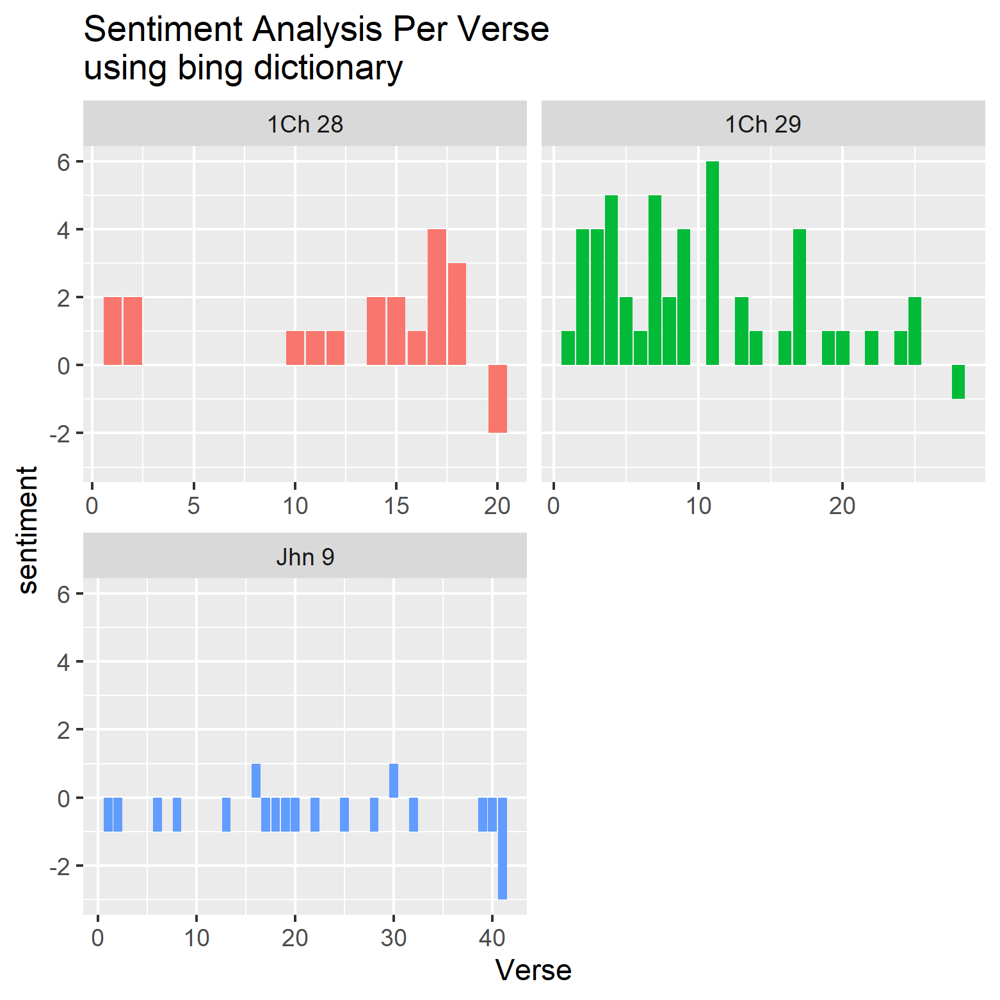
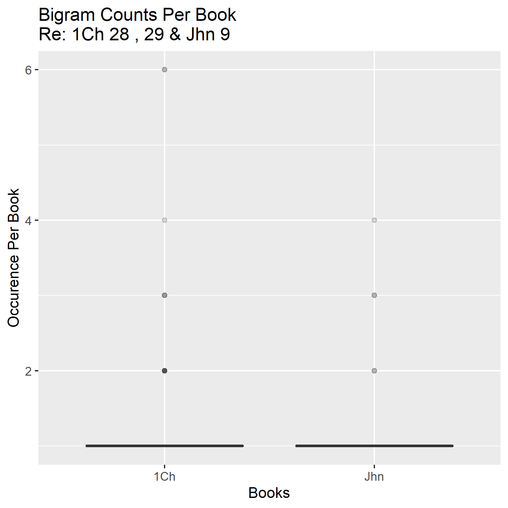
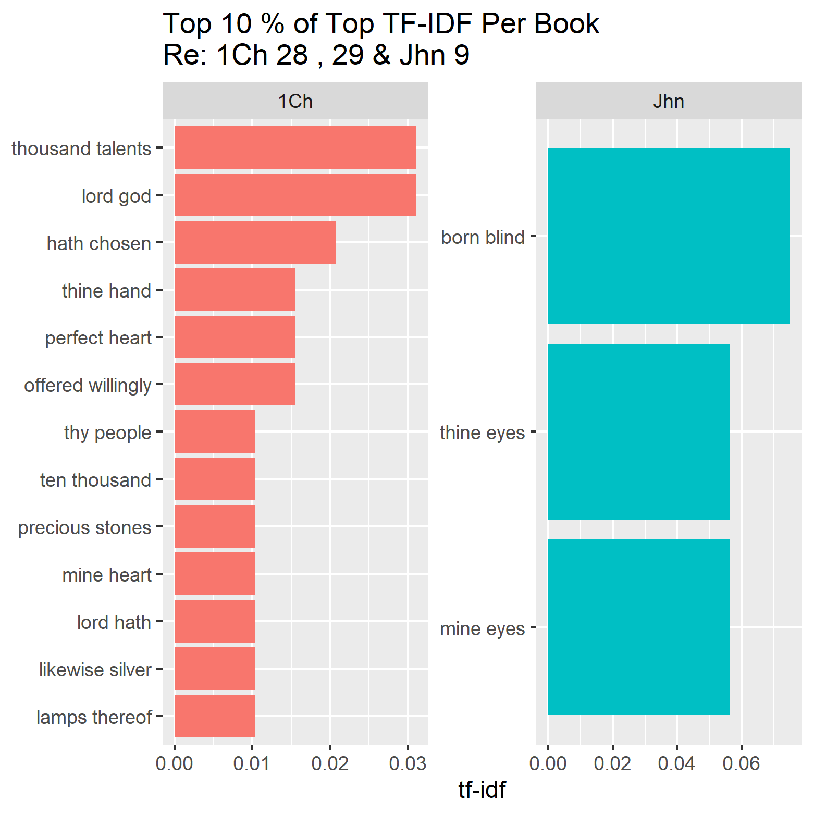
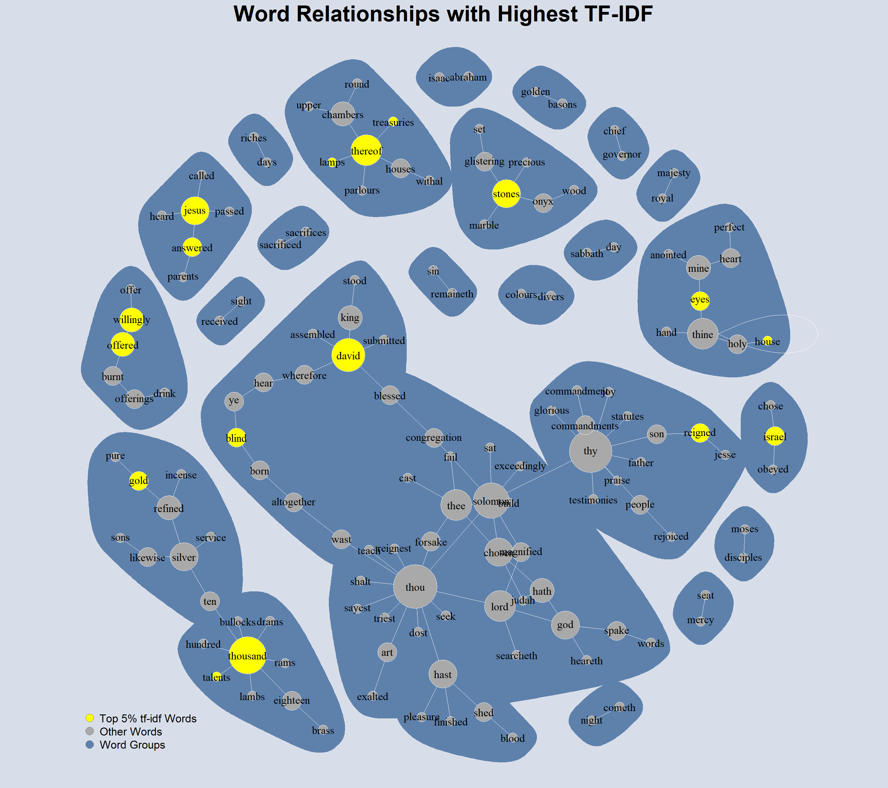
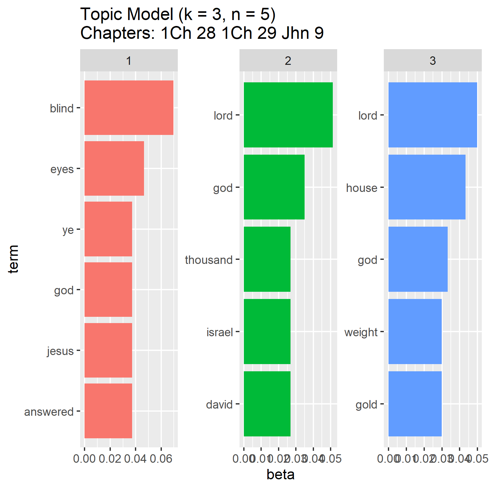

# Daily Devotion
* Time Stamp: 2021-05-26 15:20:54

## Think As Jesus Taught
* Pray without ceasing. — 1 Thessalonians 5:17

We think rightly or wrongly about prayer according to the conception we have
in our minds of prayer. If we think of prayer as the breath in our lungs and
the blood from our hearts, we think rightly. The blood flows ceaselessly, and
breathing continues ceaselessly; we are not conscious of it, but it is always
going on. We are not always conscious of Jesus keeping us in perfect joint with
God, but if we are obeying Him, He always is. Prayer is not an exercise, it
is the life. Beware of anything that stops ejaculatory prayer. “Pray without
ceasing,” keep the childlike habit of ejaculatory prayer in your heart to God
all the time.Jesus never mentioned unanswered prayer; He had the boundless
certainty that prayer is always answered. Have we by the Spirit the unspeakable
certainty that Jesus had about prayer, or do we think of the times when God
does not seem to have answered prayer? “Every one that asketh receiveth.” We
say — “But,…but…” God answers prayer in the best way, not sometimes, but every
time, although the immediate manifestation of the answer in the domain in which
we want it may not always follow. Do we expect God to answer prayer?The danger
with us is that we want to water down the things that Jesus says and make them
mean something in accordance with common sense; if it were only common sense,
it was not worth while for Him to say it. The things Jesus says about prayer are
supernatural revelations.

## Daily Wisdom
It is an easy thing to argue from precedent because it makes everything simple,
but it is a risky thing to do. Give God “elbow room”; let Him come into His
universe as He pleases. If we confine God in His working to religious people or
to certain ways, we place ourselves on an equality with God.  Baffled to Fight
Better, 51 L

## 1Ch 28
And David assembled all the princes of Israel, the princes of the tribes, and
the captains of the companies that ministered to the king by course, and the
captains over the thousands, and captains over the hundreds, and the stewards
over all the substance and possession of the king, and of his sons, with the
officers, and with the mighty men, and with all the valiant men, unto Jerusalem.
Then David the king stood up upon his feet, and said, Hear me, my brethren,
and my people: As for me, I had in mine heart to build an house of rest for the
ark of the covenant of the LORD, and for the footstool of our God, and had made
ready for the building:
But God said unto me, Thou shalt not build an house for my name, because thou
hast been a man of war, and hast shed blood.
Howbeit the LORD God of Israel chose me before all the house of my father to be
king over Israel for ever: for he hath chosen Judah to be the ruler; and of the
house of Judah, the house of my father; and among the sons of my father he liked
me to make me king over all Israel:
And of all my sons, (for the LORD hath given me many sons,) he hath chosen
Solomon my son to sit upon the throne of the kingdom of the LORD over Israel.
And he said unto me, Solomon thy son, he shall build my house and my courts: for
I have chosen him to be my son, and I will be his father.
Moreover I will establish his kingdom for ever, if he be constant to do my
commandments and my judgments, as at this day.
Now therefore in the sight of all Israel the congregation of the LORD, and in
the audience of our God, keep and seek for all the commandments of the LORD your
God: that ye may possess this good land, and leave it for an inheritance for
your children after you for ever.
And thou, Solomon my son, know thou the God of thy father, and serve him with
a perfect heart and with a willing mind: for the LORD searcheth all hearts, and
understandeth all the imaginations of the thoughts: if thou seek him, he will be
found of thee; but if thou forsake him, he will cast thee off for ever.
Take heed now; for the LORD hath chosen thee to build an house for the
sanctuary: be strong, and do it.
Then David gave to Solomon his son the pattern of the porch, and of the houses
thereof, and of the treasuries thereof, and of the upper chambers thereof, and
of the inner parlours thereof, and of the place of the mercy seat,
And the pattern of all that he had by the spirit, of the courts of the house of
the LORD, and of all the chambers round about, of the treasuries of the house of
God, and of the treasuries of the dedicated things:
Also for the courses of the priests and the Levites, and for all the work of
the service of the house of the LORD, and for all the vessels of service in the
house of the LORD.
He gave of gold by weight for things of gold, for all instruments of all
manner of service; silver also for all instruments of silver by weight, for all
instruments of every kind of service:
Even the weight for the candlesticks of gold, and for their lamps of gold,
by weight for every candlestick, and for the lamps thereof: and for the
candlesticks of silver by weight, both for the candlestick, and also for the
lamps thereof, according to the use of every candlestick.
And by weight he gave gold for the tables of shewbread, for every table; and
likewise silver for the tables of silver:
Also pure gold for the fleshhooks, and the bowls, and the cups: and for the
golden basons he gave gold by weight for every bason; and likewise silver by
weight for every bason of silver:
And for the altar of incense refined gold by weight; and gold for the pattern of
the chariot of the cherubims, that spread out their wings, and covered the ark
of the covenant of the LORD.
All this, said David, the LORD made me understand in writing by his hand upon
me, even all the works of this pattern.
And David said to Solomon his son, Be strong and of good courage, and do it:
fear not, nor be dismayed: for the LORD God, even my God, will be with thee; he
will not fail thee, nor forsake thee, until thou hast finished all the work for
the service of the house of the LORD.
And, behold, the courses of the priests and the Levites, even they shall be with
thee for all the service of the house of God: and there shall be with thee for
all manner of workmanship every willing skilful man, for any manner of service:
also the princes and all the people will be wholly at thy commandment.

## 1Ch 29
Furthermore David the king said unto all the congregation, Solomon my son, whom
alone God hath chosen, is yet young and tender, and the work is great: for the
palace is not for man, but for the LORD God.
Now I have prepared with all my might for the house of my God the gold for
things to be made of gold, and the silver for things of silver, and the brass
for things of brass, the iron for things of iron, and wood for things of wood;
onyx stones, and stones to be set, glistering stones, and of divers colours, and
all manner of precious stones, and marble stones in abundance.
Moreover, because I have set my affection to the house of my God, I have of mine
own proper good, of gold and silver, which I have given to the house of my God,
over and above all that I have prepared for the holy house,
Even three thousand talents of gold, of the gold of Ophir, and seven thousand
talents of refined silver, to overlay the walls of the houses withal:
The gold for things of gold, and the silver for things of silver, and for all
manner of work to be made by the hands of artificers. And who then is willing to
consecrate his service this day unto the LORD?
Then the chief of the fathers and princes of the tribes of Israel, and the
captains of thousands and of hundreds, with the rulers of the king's work,
offered willingly,
And gave for the service of the house of God of gold five thousand talents and
ten thousand drams, and of silver ten thousand talents, and of brass eighteen
thousand talents, and one hundred thousand talents of iron.
And they with whom precious stones were found gave them to the treasure of the
house of the LORD, by the hand of Jehiel the Gershonite.
Then the people rejoiced, for that they offered willingly, because with perfect
heart they offered willingly to the LORD: and David the king also rejoiced with
great joy.
Wherefore David blessed the LORD before all the congregation: and David said,
Blessed be thou, LORD God of Israel our father, for ever and ever.
Thine, O LORD, is the greatness, and the power, and the glory, and the victory,
and the majesty: for all that is in the heaven and in the earth is thine; thine
is the kingdom, O LORD, and thou art exalted as head above all.
Both riches and honour come of thee, and thou reignest over all; and in thine
hand is power and might; and in thine hand it is to make great, and to give
strength unto all.
Now therefore, our God, we thank thee, and praise thy glorious name.
But who am I, and what is my people, that we should be able to offer so
willingly after this sort? for all things come of thee, and of thine own have we
given thee.
For we are strangers before thee, and sojourners, as were all our fathers: our
days on the earth are as a shadow, and there is none abiding.
O LORD our God, all this store that we have prepared to build thee an house for
thine holy name cometh of thine hand, and is all thine own.
I know also, my God, that thou triest the heart, and hast pleasure in
uprightness. As for me, in the uprightness of mine heart I have willingly
offered all these things: and now have I seen with joy thy people, which are
present here, to offer willingly unto thee.
O LORD God of Abraham, Isaac, and of Israel, our fathers, keep this for ever in
the imagination of the thoughts of the heart of thy people, and prepare their
heart unto thee:
And give unto Solomon my son a perfect heart, to keep thy commandments, thy
testimonies, and thy statutes, and to do all these things, and to build the
palace, for the which I have made provision.
And David said to all the congregation, Now bless the LORD your God. And all the
congregation blessed the LORD God of their fathers, and bowed down their heads,
and worshipped the LORD, and the king.
And they sacrificed sacrifices unto the LORD, and offered burnt offerings unto
the LORD, on the morrow after that day, even a thousand bullocks, a thousand
rams, and a thousand lambs, with their drink offerings, and sacrifices in
abundance for all Israel:
And did eat and drink before the LORD on that day with great gladness. And they
made Solomon the son of David king the second time, and anointed him unto the
LORD to be the chief governor, and Zadok to be priest.
Then Solomon sat on the throne of the LORD as king instead of David his father,
and prospered; and all Israel obeyed him.
And all the princes, and the mighty men, and all the sons likewise of king
David, submitted themselves unto Solomon the king.
And the LORD magnified Solomon exceedingly in the sight of all Israel, and
bestowed upon him such royal majesty as had not been on any king before him in
Israel.
Thus David the son of Jesse reigned over all Israel.
And the time that he reigned over Israel was forty years; seven years reigned he
in Hebron, and thirty and three years reigned he in Jerusalem.
And he died in a good old age, full of days, riches, and honour: and Solomon his
son reigned in his stead.
Now the acts of David the king, first and last, behold, they are written in the
book of Samuel the seer, and in the book of Nathan the prophet, and in the book
of Gad the seer,
With all his reign and his might, and the times that went over him, and over
Israel, and over all the kingdoms of the countries.

## Jhn 9
And as Jesus passed by, he saw a man which was blind from his birth.
And his disciples asked him, saying, Master, who did sin, this man, or his
parents, that he was born blind?
Jesus answered, Neither hath this man sinned, nor his parents: but that the
works of God should be made manifest in him.
I must work the works of him that sent me, while it is day: the night cometh,
when no man can work.
As long as I am in the world, I am the light of the world.
When he had thus spoken, he spat on the ground, and made clay of the spittle,
and he anointed the eyes of the blind man with the clay,
And said unto him, Go, wash in the pool of Siloam, (which is by interpretation,
Sent.) He went his way therefore, and washed, and came seeing.
The neighbours therefore, and they which before had seen him that he was blind,
said, Is not this he that sat and begged?
Some said, This is he: others said, He is like him: but he said, I am he.
Therefore said they unto him, How were thine eyes opened?
He answered and said, A man that is called Jesus made clay, and anointed mine
eyes, and said unto me, Go to the pool of Siloam, and wash: and I went and
washed, and I received sight.
Then said they unto him, Where is he? He said, I know not.
They brought to the Pharisees him that aforetime was blind.
And it was the sabbath day when Jesus made the clay, and opened his eyes.
Then again the Pharisees also asked him how he had received his sight. He said
unto them, He put clay upon mine eyes, and I washed, and do see.
Therefore said some of the Pharisees, This man is not of God, because he
keepeth not the sabbath day. Others said, How can a man that is a sinner do such
miracles? And there was a division among them.
They say unto the blind man again, What sayest thou of him, that he hath opened
thine eyes? He said, He is a prophet.
But the Jews did not believe concerning him, that he had been blind, and
received his sight, until they called the parents of him that had received his
sight.
And they asked them, saying, Is this your son, who ye say was born blind? how
then doth he now see?
His parents answered them and said, We know that this is our son, and that he
was born blind:
But by what means he now seeth, we know not; or who hath opened his eyes, we
know not: he is of age; ask him: he shall speak for himself.
These words spake his parents, because they feared the Jews: for the Jews had
agreed already, that if any man did confess that he was Christ, he should be put
out of the synagogue.
Therefore said his parents, He is of age; ask him.
Then again called they the man that was blind, and said unto him, Give God the
praise: we know that this man is a sinner.
He answered and said, Whether he be a sinner or no, I know not: one thing I
know, that, whereas I was blind, now I see.
Then said they to him again, What did he to thee? how opened he thine eyes?
He answered them, I have told you already, and ye did not hear: wherefore would
ye hear it again? will ye also be his disciples?
Then they reviled him, and said, Thou art his disciple; but we are Moses'
disciples.
We know that God spake unto Moses: as for this fellow, we know not from whence
he is.
The man answered and said unto them, Why herein is a marvellous thing, that ye
know not from whence he is, and yet he hath opened mine eyes.
Now we know that God heareth not sinners: but if any man be a worshipper of God,
and doeth his will, him he heareth.
Since the world began was it not heard that any man opened the eyes of one that
was born blind.
If this man were not of God, he could do nothing.
They answered and said unto him, Thou wast altogether born in sins, and dost
thou teach us? And they cast him out.
Jesus heard that they had cast him out; and when he had found him, he said unto
him, Dost thou believe on the Son of God?
He answered and said, Who is he, Lord, that I might believe on him?
And Jesus said unto him, Thou hast both seen him, and it is he that talketh with
thee.
And he said, Lord, I believe. And he worshipped him.
And Jesus said, For judgment I am come into this world, that they which see not
might see; and that they which see might be made blind.
And some of the Pharisees which were with him heard these words, and said unto
him, Are we blind also?
Jesus said unto them, If ye were blind, ye should have no sin: but now ye say,
We see; therefore your sin remaineth.

## Scripture Stats

## TF-IDF Cut Off

## Top TF-IDF

## Sentiment

## Bigram Counts

## Top Bigram TF-IDF

## Bigram Networks

## LDA Topic Model

