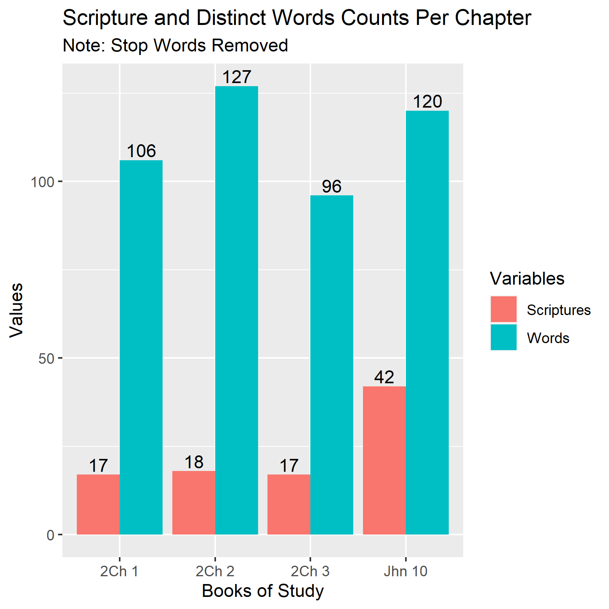
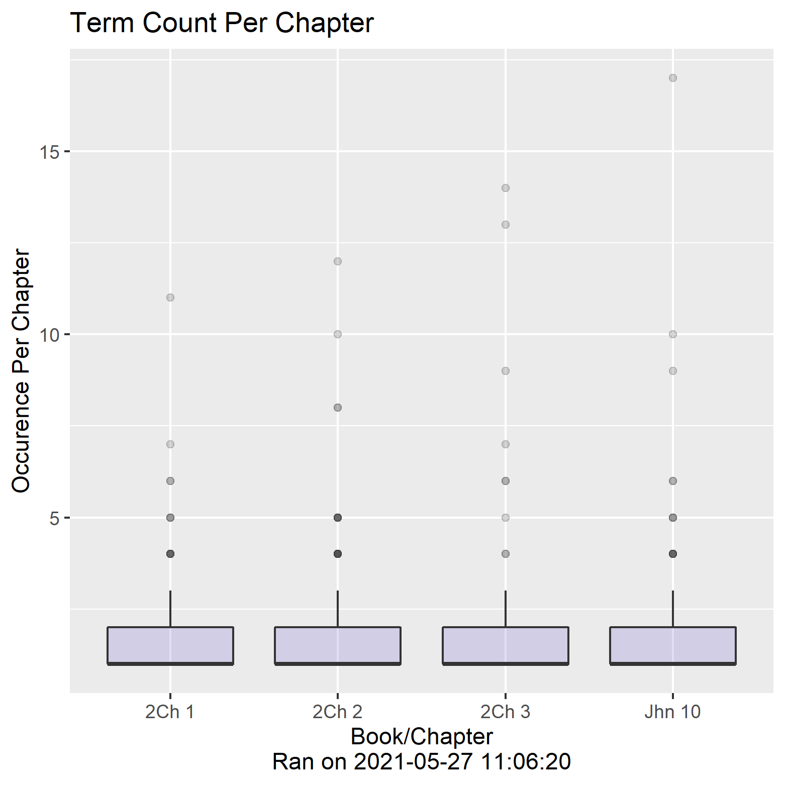
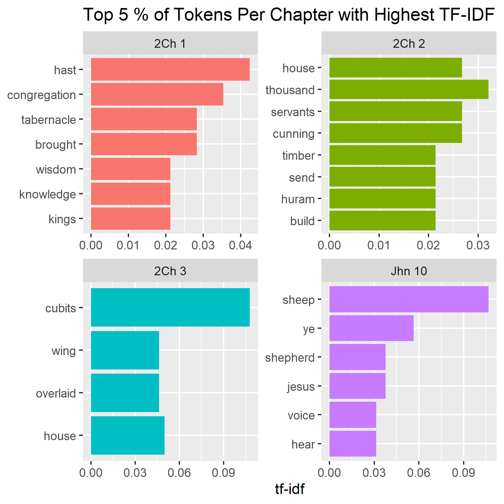
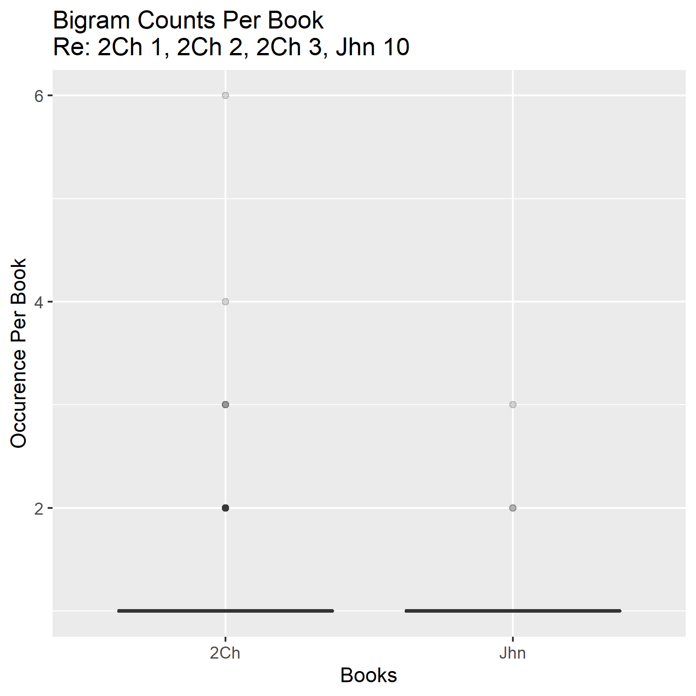
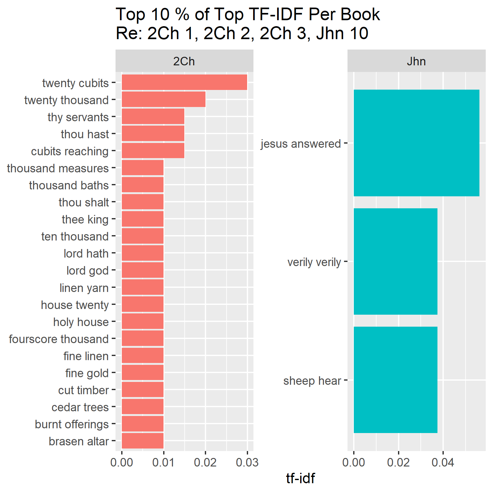
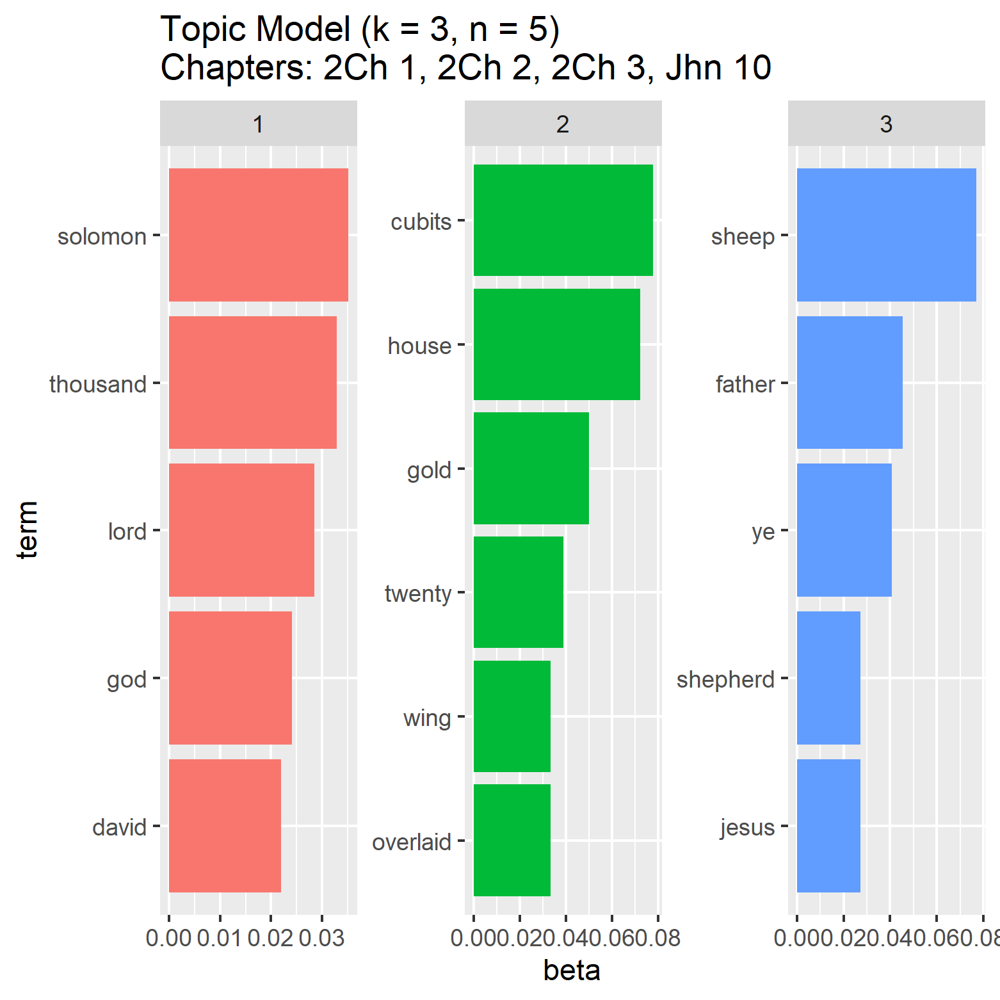

# Daily Devotion
* Time Stamp: 2021-05-27 11:22:17

## The Life That Lives
* Tarry ye in the city of Jerusalem, until ye be endued with power from on high.
— Luke 24:49

The disciples had to tarry until the day of Pentecost not for their own
preparation only; they had to wait until the Lord was glorified historically.
As soon as He was glorified, what happened? “Therefore being by the right hand
of God exalted, and having received of the Father the promise of the Holy Ghost,
He hath shed forth this, which ye now see and hear.” The parenthesis in John
7:39 (“For the Holy Ghost was not yet given; because that Jesus was not yet
glorified”) does not apply to us; the Holy Ghost has been given, the Lord is
glorified; the waiting depends not on God’s providence, but on our fitness.The
Holy Spirit’s influence and power were at work before Pentecost, but He was not
here. Immediately Our Lord was glorified in Ascension, the Holy Spirit came into
this world, and He has been here ever since. We have to receive the revelation
that He is here. The reception of the Holy Spirit is the maintained attitude
of a believer. When we receive the Holy Spirit, we receive quickening life from
the ascended Lord.It is not the baptism of the Holy Ghost which changes men, but
the power of the ascended Christ coming into men’s lives by the Holy Ghost that
changes them. We too often divorce what the New Testament never divorces. The
baptism of the Holy Ghost is not an experience apart from Jesus Christ: it is
the evidence of the ascended Christ.The baptism of the Holy Ghost does not make
you think of Time or Eternity, it is one amazing glorious NOW. “This is life
eternal that they might know Thee.” Begin to know Him now, and finish never.

## Daily Wisdom
The Bible does not thrill; the Bible nourishes. Give time to the reading of the
Bible and the recreating effect is as real as that of fresh air physically. 
Disciples Indeed, 387 R

## Scripture Reading
* 2 Chronicles 1-3; John 10:1-23

### 2Ch 1
And Solomon the son of David was strengthened in his kingdom, and the LORD his
God was with him, and magnified him exceedingly.
Then Solomon spake unto all Israel, to the captains of thousands and of
hundreds, and to the judges, and to every governor in all Israel, the chief of
the fathers.
So Solomon, and all the congregation with him, went to the high place that was
at Gibeon; for there was the tabernacle of the congregation of God, which Moses
the servant of the LORD had made in the wilderness.
But the ark of God had David brought up from Kirjathjearim to the place which
David had prepared for it: for he had pitched a tent for it at Jerusalem.
Moreover the brasen altar, that Bezaleel the son of Uri, the son of Hur, had
made, he put before the tabernacle of the LORD: and Solomon and the congregation
sought unto it.
And Solomon went up thither to the brasen altar before the LORD, which was at
the tabernacle of the congregation, and offered a thousand burnt offerings upon
it.
In that night did God appear unto Solomon, and said unto him, Ask what I shall
give thee.
And Solomon said unto God, Thou hast shewed great mercy unto David my father,
and hast made me to reign in his stead.
Now, O LORD God, let thy promise unto David my father be established: for thou
hast made me king over a people like the dust of the earth in multitude.
Give me now wisdom and knowledge, that I may go out and come in before this
people: for who can judge this thy people, that is so great?
And God said to Solomon, Because this was in thine heart, and thou hast not
asked riches, wealth, or honour, nor the life of thine enemies, neither yet
hast asked long life; but hast asked wisdom and knowledge for thyself, that thou
mayest judge my people, over whom I have made thee king:
Wisdom and knowledge is granted unto thee; and I will give thee riches, and
wealth, and honour, such as none of the kings have had that have been before
thee, neither shall there any after thee have the like.
Then Solomon came from his journey to the high place that was at Gibeon to
Jerusalem, from before the tabernacle of the congregation, and reigned over
Israel.
And Solomon gathered chariots and horsemen: and he had a thousand and four
hundred chariots, and twelve thousand horsemen, which he placed in the chariot
cities, and with the king at Jerusalem.
And the king made silver and gold at Jerusalem as plenteous as stones, and cedar
trees made he as the sycomore trees that are in the vale for abundance.
And Solomon had horses brought out of Egypt, and linen yarn: the king's
merchants received the linen yarn at a price.
And they fetched up, and brought forth out of Egypt a chariot for six hundred
shekels of silver, and an horse for an hundred and fifty: and so brought they
out horses for all the kings of the Hittites, and for the kings of Syria, by
their means.

### 2Ch 2
And Solomon determined to build an house for the name of the LORD, and an house
for his kingdom.
And Solomon told out threescore and ten thousand men to bear burdens, and
fourscore thousand to hew in the mountain, and three thousand and six hundred to
oversee them.
And Solomon sent to Huram the king of Tyre, saying, As thou didst deal with
David my father, and didst send him cedars to build him an house to dwell
therein, even so deal with me.
Behold, I build an house to the name of the LORD my God, to dedicate it to him,
and to burn before him sweet incense, and for the continual shewbread, and for
the burnt offerings morning and evening, on the sabbaths, and on the new moons,
and on the solemn feasts of the LORD our God. This is an ordinance for ever to
Israel.
And the house which I build is great: for great is our God above all gods.
But who is able to build him an house, seeing the heaven and heaven of heavens
cannot contain him? who am I then, that I should build him an house, save only
to burn sacrifice before him?
Send me now therefore a man cunning to work in gold, and in silver, and in
brass, and in iron, and in purple, and crimson, and blue, and that can skill
to grave with the cunning men that are with me in Judah and in Jerusalem, whom
David my father did provide.
Send me also cedar trees, fir trees, and algum trees, out of Lebanon: for I know
that thy servants can skill to cut timber in Lebanon; and, behold, my servants
shall be with thy servants,
Even to prepare me timber in abundance: for the house which I am about to build
shall be wonderful great.
And, behold, I will give to thy servants, the hewers that cut timber, twenty
thousand measures of beaten wheat, and twenty thousand measures of barley, and
twenty thousand baths of wine, and twenty thousand baths of oil.
Then Huram the king of Tyre answered in writing, which he sent to Solomon,
Because the LORD hath loved his people, he hath made thee king over them.
Huram said moreover, Blessed be the LORD God of Israel, that made heaven and
earth, who hath given to David the king a wise son, endued with prudence and
understanding, that might build an house for the LORD, and an house for his
kingdom.
And now I have sent a cunning man, endued with understanding, of Huram my
father's,
The son of a woman of the daughters of Dan, and his father was a man of Tyre,
skilful to work in gold, and in silver, in brass, in iron, in stone, and in
timber, in purple, in blue, and in fine linen, and in crimson; also to grave any
manner of graving, and to find out every device which shall be put to him, with
thy cunning men, and with the cunning men of my lord David thy father.
Now therefore the wheat, and the barley, the oil, and the wine, which my lord
hath spoken of, let him send unto his servants:
And we will cut wood out of Lebanon, as much as thou shalt need: and we will
bring it to thee in floats by sea to Joppa; and thou shalt carry it up to
Jerusalem.
And Solomon numbered all the strangers that were in the land of Israel, after
the numbering wherewith David his father had numbered them; and they were found
an hundred and fifty thousand and three thousand and six hundred.
And he set threescore and ten thousand of them to be bearers of burdens, and
fourscore thousand to be hewers in the mountain, and three thousand and six
hundred overseers to set the people a work.

### Jhn 10
Then Solomon began to build the house of the LORD at Jerusalem in mount Moriah,
where the LORD appeared unto David his father, in the place that David had
prepared in the threshingfloor of Ornan the Jebusite.
And he began to build in the second day of the second month, in the fourth year
of his reign.
Now these are the things wherein Solomon was instructed for the building of
the house of God. The length by cubits after the first measure was threescore
cubits, and the breadth twenty cubits.
And the porch that was in the front of the house, the length of it was according
to the breadth of the house, twenty cubits, and the height was an hundred and
twenty: and he overlaid it within with pure gold.
And the greater house he cieled with fir tree, which he overlaid with fine gold,
and set thereon palm trees and chains.
And he garnished the house with precious stones for beauty: and the gold was
gold of Parvaim.
He overlaid also the house, the beams, the posts, and the walls thereof, and the
doors thereof, with gold; and graved cherubims on the walls.
And he made the most holy house, the length whereof was according to the breadth
of the house, twenty cubits, and the breadth thereof twenty cubits: and he
overlaid it with fine gold, amounting to six hundred talents.
And the weight of the nails was fifty shekels of gold. And he overlaid the upper
chambers with gold.
And in the most holy house he made two cherubims of image work, and overlaid
them with gold.
And the wings of the cherubims were twenty cubits long: one wing of the one
cherub was five cubits, reaching to the wall of the house: and the other wing
was likewise five cubits, reaching to the wing of the other cherub.
And one wing of the other cherub was five cubits, reaching to the wall of the
house: and the other wing was five cubits also, joining to the wing of the other
cherub.
The wings of these cherubims spread themselves forth twenty cubits: and they
stood on their feet, and their faces were inward.
And he made the vail of blue, and purple, and crimson, and fine linen, and
wrought cherubims thereon.
Also he made before the house two pillars of thirty and five cubits high, and
the chapiter that was on the top of each of them was five cubits.
And he made chains, as in the oracle, and put them on the heads of the pillars;
and made an hundred pomegranates, and put them on the chains.
And he reared up the pillars before the temple, one on the right hand, and the
other on the left; and called the name of that on the right hand Jachin, and the
name of that on the left Boaz.

## Scripture Stats

## TF-IDF Cut Off

## Top TF-IDF

## Sentiment

## Bigram Counts

## Top Bigram TF-IDF

## Bigram Networks

## LDA Topic Model

