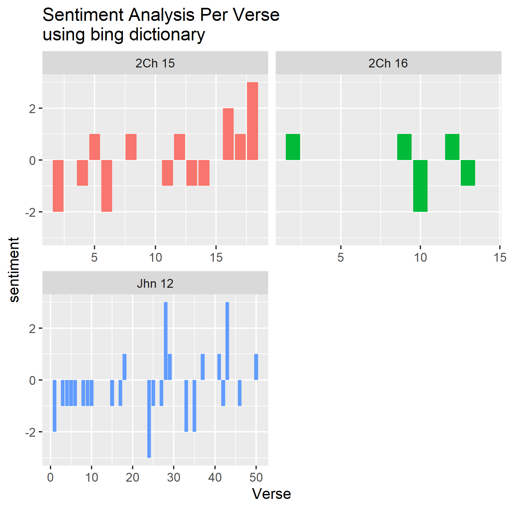

# Daily Devotion
* Time Stamp: 2021-06-01 09:13:13

## The Staggering Question
* Son of man, can these bones live? — Ezekiel 37:3

Can that sinner be turned into a saint? Can that twisted life be put right?
There is only one answer: “O Lord, Thou knowest, I don’t.” Never trample in with
religious common sense and say, "Oh, yes, with a little more Bible reading and
devotion and prayer, I see how it can be done."

It is much easier to do something than to trust in God; we mistake panic for
inspiration. That is why there are so few fellow-workers with God and so many
workers for Him. We would far rather work for God than believe in Him. Am I
quite sure that God will do what I cannot do? I despair of men in the degree in
which I have never realized that God has done anything for me. Is my experience
such a wonderful realization of God's power and might that I can never despair
of anyone I see? Have I had any spiritual work done in me at all? The degree of
panic is the degree of the lack of personal spiritual experience.“

"Behold, O my people, I will open your graves."” When God wants to show you what
human nature is like apart from Himself, He shows it to you in yourself. If the
Spirit of God has given you a vision of what you are apart from the grace of
God (and He only does it when His Spirit is at work), you know there is no
criminal who is half so bad in actuality as you know yourself to be in
possibility. My grave”has been opened by God and I know that in me (that is
in my flesh) dwelleth no good thing.”God's Spirit continually reveals what
human nature is like apart from His grace.

## Daily Wisdom
We are apt to think that everything that happens to us is to be turned into
useful teaching; it is to be turned into something better than teaching, viz.
into character. We shall find that the spheres God brings us into are not meant
to teach us something but to make us something.

(The Love of God—The Ministry of the Unnoticed, 664 L)

## Scripture Reading
* 2 Chronicles 15-16; John 12:27-50

### 2Ch 15
And the Spirit of God came upon **Azariah** the son of Oded:
And he went out to meet Asa, and said unto him, Hear ye me, Asa, and all Judah
and Benjamin; The LORD is with you, while ye be with him; and if ye seek him, he
will be found of you; but if ye forsake him, he will forsake you.
Now for a long season **Israel hath been without the true God, and without a
teaching priest, and without law.**
But when they in their trouble did turn unto the LORD God of Israel, and sought
him, he was found of them.
And in those times there was no peace to him that went out, nor to him that came
in, but great vexations were upon all the inhabitants of the countries.
And nation was destroyed of nation, and city of city: **for God did vex them
with all adversity.**
Be ye strong therefore, and let not your hands be weak: for your work shall be
rewarded.
And when **Asa heard these words, and the prophecy of Oded the prophet, he took
courage, and put away the abominable idols out of all the land of Judah and
Benjamin, and out of the cities which he had taken from mount Ephraim, and
renewed the altar of the LORD, that was before the porch of the LORD.**
And he gathered all Judah and Benjamin, and the strangers with them out of
Ephraim and Manasseh, and out of Simeon: for they fell to him out of Israel in
abundance, when they saw that the LORD his God was with him.
So they gathered themselves together at Jerusalem in the third month, in the
fifteenth year of the reign of Asa.
And they offered unto the LORD the same time, of the spoil which they had
brought, seven hundred oxen and seven thousand sheep.
And they entered into a covenant to seek the LORD God of their fathers with all
their heart and with all their soul;
That whosoever would not seek the LORD God of Israel should be put to death,
whether small or great, whether man or woman.
And they sware unto the LORD with a loud voice, and with shouting, and with
trumpets, and with cornets.
And all Judah rejoiced at the oath: for they had sworn with all their heart, and
sought him with their whole desire; and he was found of them: and the LORD gave
them rest round about.
And also concerning Maachah the mother of Asa the king, he removed her from
being queen, because she had made an idol in a grove: and Asa cut down her idol,
and stamped it, and burnt it at the brook Kidron.
But the high places were not taken away out of Israel: nevertheless the heart of
Asa was perfect all his days.
And he brought into the house of God the things that his father had dedicated,
and that he himself had dedicated, silver, and gold, and vessels.
And there was no more war unto the five and thirtieth year of the reign of Asa.

### 2Ch 16
In the six and thirtieth year of the reign of Asa Baasha king of Israel came up
against Judah, and built Ramah, to the intent that he might let none go out or
come in to Asa king of Judah.
Then Asa brought out silver and gold out of the treasures of the house of the
LORD and of the king's house, and sent to Benhadad king of Syria, that dwelt at
Damascus, saying,
There is a league between me and thee, as there was between my father and thy
father: behold, I have sent thee silver and gold; go, break thy league with
Baasha king of Israel, that he may depart from me.
And Benhadad hearkened unto king Asa, and sent the captains of his armies
against the cities of Israel; and they smote Ijon, and Dan, and Abelmaim, and
all the store cities of Naphtali.
And it came to pass, when Baasha heard it, that he left off building of Ramah,
and let his work cease.
Then Asa the king took all Judah; and they carried away the stones of Ramah, and
the timber thereof, wherewith Baasha was building; and he built therewith Geba
and Mizpah.
And at that time Hanani the seer came to Asa king of Judah, and said unto him,
Because thou hast relied on the king of Syria, and not relied on the LORD thy
God, therefore is the host of the king of Syria escaped out of thine hand.
Were not the Ethiopians and the Lubims a huge host, with very many chariots and
horsemen? yet, because thou didst rely on the LORD, he delivered them into thine
hand.
For the eyes of the LORD run to and fro throughout the whole earth, to shew
himself strong in the behalf of them whose heart is perfect toward him. Herein
thou hast done foolishly: therefore from henceforth thou shalt have wars.
Then Asa was wroth with the seer, and put him in a prison house; for he was in
a rage with him because of this thing. And Asa oppressed some of the people the
same time.
And, behold, the acts of Asa, first and last, lo, they are written in the book
of the kings of Judah and Israel.
And Asa in the thirty and ninth year of his reign was diseased in his feet,
until his disease was exceeding great: yet in his disease he sought not to the
LORD, but to the physicians.
And Asa slept with his fathers, and died in the one and fortieth year of his
reign.
And they buried him in his own sepulchres, which he had made for himself in the
city of David, and laid him in the bed which was filled with sweet odours and
divers kinds of spices prepared by the apothecaries' art: and they made a very
great burning for him.

### Jhn 12
Then Jesus six days before the passover came to Bethany, where Lazarus was which
had been dead, whom he raised from the dead.
There they made him a supper; and Martha served: but Lazarus was one of them
that sat at the table with him.
Then took Mary a pound of ointment of spikenard, very costly, and anointed the
feet of Jesus, and wiped his feet with her hair: and the house was filled with
the odour of the ointment.
Then saith one of his disciples, Judas Iscariot, Simon's son, which should
betray him,
Why was not this ointment sold for three hundred pence, and given to the poor?
This he said, not that he cared for the poor; but because he was a thief, and
had the bag, and bare what was put therein.
Then said Jesus, Let her alone: against the day of my burying hath she kept
this.
For the poor always ye have with you; but me ye have not always.
Much people of the Jews therefore knew that he was there: and they came not for
Jesus' sake only, but that they might see Lazarus also, whom he had raised from
the dead.
But the chief priests consulted that they might put Lazarus also to death;
Because that by reason of him many of the Jews went away, and believed on Jesus.
On the next day much people that were come to the feast, when they heard that
Jesus was coming to Jerusalem,
Took branches of palm trees, and went forth to meet him, and cried, Hosanna:
Blessed is the King of Israel that cometh in the name of the Lord.
And Jesus, when he had found a young ass, sat thereon; as it is written,
Fear not, daughter of Sion: behold, thy King cometh, sitting on an ass's colt.
These things understood not his disciples at the first: but when Jesus was
glorified, then remembered they that these things were written of him, and that
they had done these things unto him.
The people therefore that was with him when he called Lazarus out of his grave,
and raised him from the dead, bare record.
For this cause the people also met him, for that they heard that he had done
this miracle.
The Pharisees therefore said among themselves, Perceive ye how ye prevail
nothing? behold, the world is gone after him.
And there were certain Greeks among them that came up to worship at the feast:
The same came therefore to Philip, which was of Bethsaida of Galilee, and
desired him, saying, Sir, we would see Jesus.
Philip cometh and telleth Andrew: and again Andrew and Philip tell Jesus.
And Jesus answered them, saying, The hour is come, that the Son of man should be
glorified.
Verily, verily, I say unto you, Except a corn of wheat fall into the ground and
die, it abideth alone: but if it die, it bringeth forth much fruit.
He that loveth his life shall lose it; and he that hateth his life in this world
shall keep it unto life eternal.
If any man serve me, let him follow me; and where I am, there shall also my
servant be: if any man serve me, him will <U+2794>my Father honour.
Now is my soul troubled; and what shall I say? Father, save me from this hour:
but for this cause came I unto this hour.
Father, glorify thy name. Then came there a voice from heaven, saying, I have
both glorified it, and will glorify it again.
The people therefore, that stood by, and heard it, said that it thundered:
others said, An angel spake to him.
Jesus answered and said, This voice came not because of me, but for your sakes.
Now is the judgment of this world: now shall the prince of this world be cast
out.
And I, if I be lifted up from the earth, will draw all men unto me.
This he said, signifying what death he should die.
The people answered him, We have heard out of the law that Christ abideth for
ever: and how sayest thou, The Son of man must be lifted up? who is this Son of
man?
Then Jesus said unto them, Yet a little while is the light with you. Walk while
ye have the light, lest darkness come upon you: for he that walketh in darkness
knoweth not whither he goeth.
While ye have light, believe in the light, that ye may be the children of light.
These things spake Jesus, and departed, and did hide himself from them.
But though he had done so many miracles before them, yet they believed not on
him:
That the saying of Esaias the prophet might be fulfilled, which he spake,
Lord, who hath believed our report? and to whom hath the arm of the Lord been
revealed?
Therefore they could not believe, because that Esaias said again,
He hath blinded their eyes, and hardened their heart; that they should not see
with their eyes, nor understand with their heart, and be converted, and I should
heal them.
These things said Esaias, when he saw his glory, and spake of him.
Nevertheless among the chief rulers also many believed on him; but because
of the Pharisees they did not confess him, lest they should be put out of the
synagogue:
For they loved the praise of men more than the praise of God.
Jesus cried and said, He that believeth on me, believeth not on me, but on him
that sent me.
And he that seeth me seeth him that sent me.
I am come a light into the world, that whosoever believeth on me should not
abide in darkness.
And if any man hear my words, and believe not, I judge him not: for I came not
to judge the world, but to save the world.
He that rejecteth me, and receiveth not my words, hath one that judgeth him: the
word that I have spoken, the same shall judge him in the last day.
For I have not spoken of myself; but the Father which sent me, he gave me a
commandment, what I should say, and what I should speak.
And I know that his commandment is life everlasting: whatsoever I speak
therefore, even as the Father said unto me, so I speak.

## Scripture Stats

## TF-IDF Cut Off

## Top TF-IDF

## Sentiment

## Bigram Counts

## Top Bigram TF-IDF

## Bigram Networks

## LDA Topic Model

